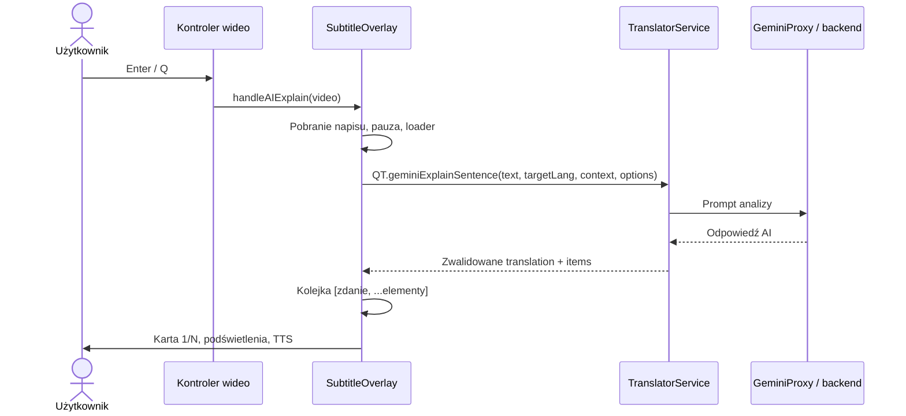

# Enter — analiza zdania AI w Lectoro

Stan analizy: 20 września 2026. Dokument opisuje aktualny kod repozytorium. Wygląd odtworzono z renderera DOM i CSS; nie jest to wynik wizualnego testu rozszerzenia w odtwarzaczu.

## 1. Przeznaczenie

**Enter / Q** otwiera analizę aktualnego napisu i zatrzymuje film. Pierwszy krok pokazuje tłumaczenie całego zdania na język ojczysty, a kolejne — wybrane przez AI słowa, idiomy i zwroty wraz ze znaczeniem oraz opcjonalnym wyjaśnieniem. Treść jest odczytywana przez lektora i można ją zapisać do powtórek.

Funkcja korzysta ze wspólnego kontrolera wideo oraz rejestru adapterów odtwarzaczy. Dostępność zależy od wykrycia wideo i tekstu napisów. Gdy nie ma bieżącego napisu, kod próbuje użyć ostatniego wpisu historii napisów. Bez żadnego tekstu kończy działanie.

## 2. Jak wygląda interfejs

Dymek jest ciemną, półprzezroczystą kartą nad napisami. Nagłówek zawiera wyrównane do prawej strzałki oraz licznik `1/N`. Pod nim znajduje się wyśrodkowana treść i przycisk głośnika. Na dole są dwie akcje: zwykły zapis (`Z`) i wygenerowanie zdania AI z zapisem (`X`). Etykiety są lokalizowane.

Schemat poglądowy, nie zrzut ekranu:

```text
Krok 1 — całe zdanie
╭──────────────────────────────────────────╮
│                                ◀ 1/3 ▶   │
│       Tłumaczenie całego zdania  🔊       │
│──────────────────────────────────────────│
│       Zapisz [Z]      Zdanie AI [X]       │
╰──────────────────────────────────────────╯
               Oryginalne napisy filmu

Kolejny krok — słowo lub zwrot
╭──────────────────────────────────────────╮
│                                ◀ 2/3 ▶   │
│              analizowany zwrot 🔊        │
│                 tłumaczenie              │
│          opcjonalne wyjaśnienie użycia    │
│──────────────────────────────────────────│
│       Zapisz [Z]      Zdanie AI [X]       │
╰──────────────────────────────────────────╯
       Napisy z podświetlonym zwrotem
```

### Karta całego zdania

Wyświetla samo tłumaczenie i głośnik. Oryginalnego zdania nie powtarza w treści karty; pozostaje ono w napisach filmu. Choć obiekt kroku przechowuje `explanation`, renderer nie pokazuje wyjaśnienia na etapie `sentence`.

### Karta słowa lub zwrotu

Wyświetla termin w kolorze turkusowym `#00ffea`, obok głośnik, poniżej jasne pogrubione znaczenie i opcjonalne wyjaśnienie. Wyjaśnienie jest formatowane przez `QT.formatSpeechMarkup`, co umożliwia obsługę cytowanych fragmentów przez mechanizm TTS.

### Parametry wizualne

Źródło: [styles.css](../styles.css), selektory `#__qt_sentence_translation` oraz `.__qt_ai-explain-overlay`.

| Element | Aktualna konfiguracja |
| --- | --- |
| Tło | `#0f0f23bf`, półprzezroczysty ciemny granat |
| Rozmycie tła | `blur(20px) saturate(1.4)` |
| Narożniki | `16px` |
| Obramowanie | `1px solid rgba(255,255,255,0.08)` |
| Cień | `0 8px 32px rgba(0,0,0,0.4)` oraz wewnętrzna jasna obwódka |
| Maksymalna szerokość | `min(520px, calc(100vw - 24px))` |
| Maksymalna wysokość | `min(560px, calc(100vh - 48px))` |
| Pozycja | `fixed`, `z-index: 2147483647` |
| Typografia bazowa | `14px/1.5`, Inter i fonty systemowe |
| Nawigacja | Małe półprzezroczyste przyciski; niedostępna strzałka ma przezroczystość `0.25` |

`positionOverlay()` kotwiczy kartę najpierw względem aktywnie podświetlonego zwrotu, następnie względem napisów lub zapamiętanej geometrii. Standardowy odstęp wynosi 16 px. Jeśli nad napisami brakuje miejsca, karta przechodzi pod nie. Pozycja jest ograniczana marginesem 12 px od krawędzi okna.

Rozmiary tekstu są wyliczane względem efektywnego rozmiaru napisów, z ograniczeniami:

| Treść | Mnożnik | Zakres |
| --- | --- | --- |
| Termin | 0,58 | 13–30 px |
| Znaczenie i tłumaczenie zdania | 0,48 | 12–26 px |
| Wyjaśnienie | 0,40 | 11–20 px |
| Metadane i licznik | 0,30 | 9–15 px |

### Ładowanie i animacja

Po uruchomieniu pojawia się kompaktowy loader z `✨` i lokalizowanym komunikatem analizy. Po uzyskaniu wyniku mechanizm `revealOverlayContent()` mierzy zawartość, rozszerza kartę i odsłania tekst. CSS przewiduje wejście karty przez 0,2 s, zmianę wymiarów przez 0,22 s i odsłonięcie treści przez 0,13 s. Obramowanie AI wykorzystuje obracany gradient stożkowy w odcieniach fioletu i turkusu. W CSS istnieją reguły ograniczające animacje przy `prefers-reduced-motion`.

### Podświetlenia napisów

Aktualny termin otrzymuje klasę `__qt_ai-sub-active` i turkusowo-fioletowe wyróżnienie. Pozostałe dopasowane elementy kolejki mają fioletowe podświetlenie (`__qt_ai-sub-queued` / `__qt_ai-sub-upcoming`). Wielowyrazowe zwroty mogą być grupowane przez `__qt_ai-sub-wrap`. Kliknięcie dopasowanego elementu napisów pozwala przejść do jego kroku. Nie każde słowo musi mieć odpowiednik w kolejce.

### Elementy, których aktualnie nie widać

Renderer `renderAiExplainContent()` **nie tworzy wstążki etapów ani pigułek kolejki**. W kodzie pozostały ich style i listenery, lecz nie oznacza to, że są częścią obecnego widoku.

Odznaki typu/CEFR oraz kredytów nie są renderowane w aktualnym nagłówku; odpowiadające im selektory CSS mają także `display: none`. Kod nadal oblicza `aiExplainCreditBadge` i przechowuje metadane analizy. Nie należy opisywać ich jako widocznych elementów karty.

## 3. Sterowanie

Źródło: [universal-video-controller.js](../video/universal-video-controller.js), `handleKeyDown()`, oraz pomocniczy listener w [subtitle-overlay.js](../video/subtitle-overlay.js).

| Klawisz / interakcja | Działanie |
| --- | --- |
| Enter, numeryczny Enter, Q | Otwiera analizę; przy otwartej analizie zamyka ją i wznawia film |
| W, ↑, Escape | Zamyka otwartą analizę i wznawia film |
| D, → | Następny krok analizy |
| A, ← | Poprzedni krok analizy |
| Z, V | Zapisuje aktualny element do powtórek |
| X | Generuje przykładowe zdanie AI i zapisuje kartę |
| Strzałki w nagłówku | Zmieniają krok; nie przechodzą poza granice kolejki |
| Dopasowany zwrot w napisach | Przechodzi do przypisanego kroku |
| Głośnik | Steruje odsłuchem treści |

Kontroler pomija zdarzenia podczas wpisywania tekstu w polu edycji. Przytrzymany Enter/Q nie przełącza wielokrotnie widoku (`e.repeat`). Nawigacja A/D w otwartym trybie AI przełącza kroki zamiast przewijać napisy.

## 4. Przepływ danych i stan



`handleAIExplain()` wykonuje następujące operacje:

1. Pobiera `activeText`, tekst z rejestru albo ostatni napis z historii.
2. Zwiększa `aiExplainRequestId`; odpowiedź może zmienić widok tylko przy aktywnej sesji i zgodnym identyfikatorze.
3. Kończy czytanie i zamyka tooltip słowa bez wznowienia filmu. Przywraca napisy po innych trybach, usuwa dodatkowe tłumaczenie pod nimi, ustawia `data-lectoro-ai-active` i pauzuje wideo.
4. Zapamiętuje położenie napisów, pobiera cache użycia AI i pokazuje loader.
5. Pobiera język ojczysty przez `QT.getTargetLang()`, język nauki przez `SharedTranslatorService.getLearningLang()` oraz kontekst przez `getActiveSubtitleContext()`.
6. Wywołuje `QT.geminiExplainSentence()`, będące delegacją do `SharedTranslatorService.explainSentence()`. Ten przepływ nie przygotowuje wcześniej tłumaczenia Google.
7. Normalizuje tłumaczenie, odrzuca elementy bez terminu i definicje rozpoznane jako nazwy własne. Buduje kolejkę, której pierwszym elementem zawsze jest całe zdanie.
8. Pokazuje pierwszy krok, aktualizuje podświetlenia i uruchamia TTS.

Serwis tłumaczeń korzysta z promptu w [ai-prompts.js](../shared/ai-prompts.js), sprawdza język źródłowy i docelowy oraz wymagane tłumaczenie. Parametry żądania analizy to temperatura `0.2` i `maxOutputTokens: 1000`. Warstwę pośredniczącą obsługują [gemini-proxy.js](../shared/gemini-proxy.js), [background.js](../background.js) i backend [functions/index.js](../functions/index.js). W aktualnym kodzie backendu wskazano model `gemini-2.5-flash-lite`; nie jest to weryfikacja konfiguracji wdrożonej usługi.

## 5. Lektor i automatyczne przechodzenie

Wspólny serwis TTS obsługuje teraz Gemini 2.5 Flash TTS z głosami Sulafat i Algieba w miejsce ElevenLabs. Wybrany tryb głosu i limity decydują o użyciu syntezy premium; dostępny pozostaje głos przeglądarki. Szczegóły migracji: [Gemini TTS](Gemini-TTS.md).

Dla całego zdania lektor czyta tłumaczenie w języku ojczystym. Dla słowa/zwrotu czyta najpierw termin w języku nauki, następnie po 350 ms znaczenie i wyjaśnienie w języku ojczystym. Kod zawiera dodatkową próbę przetłumaczenia tekstu rozpoznanego jako angielski mimo oczekiwanego innego języka.

Po odsłuchu kolejny krok uruchamia się po 900 ms; bez treści oznaczonej jako odczytana opóźnienie wynosi 3000 ms. Ręczna zmiana kroku wyłącza automatyczne przechodzenie w bieżącej sesji. Ostatni krok pozostaje otwarty. `aiExplainSpeechToken` unieważnia starszy odsłuch po zmianie kroku lub zamknięciu.

## 6. Zapis do powtórek

**Z / V — zwykły zapis:** zapisuje aktualny termin i znaczenie, języki, wyjaśnienie oraz, jeśli ma zastosowanie, oryginalne zdanie kontekstowe i jego tłumaczenie. Próbuje też dołączyć zrzut wideo, URL i czas zapisu. Dla karty całego zdania nie powiela zdania w polu kontekstu. Operacja kończy się wywołaniem `QT.saveWord()`.

**X — zdanie AI:** wywołuje `QT.geminiGenerateSentence()` dla aktualnego elementu, po czym zapisuje wygenerowany przykład i tłumaczenie przez `QT.saveWord()`. Powtórzenie samego terminu nie jest zachowywane jako nowy przykład. Po sukcesie przykład może pojawić się pod treścią karty.

Przyciski mają stany ładowania i potwierdzenia. `aiSavedIndices` i `aiAiSavedIndices` przechowują osobno informację o zapisie dla kroków bieżącej sesji. Sam Enter nie eksportuje bezpośrednio danych do Anki.

## 7. Błędy, limit i zamykanie

- Przy zwykłym błędzie AI kod próbuje uzyskać samo tłumaczenie przez `SharedTranslatorService.translate()`, a następnie `QT.translate()`. Jeśli analiza się nie powiodła, możliwy jest widok `1/1` bez rozbicia na słowa.
- Jeśli nie uda się uzyskać tłumaczenia, karta pokazuje komunikat błędu.
- Błąd rozpoznany przez `GeminiProxy.isLimitError()` prowadzi do karty limitu zamiast zwykłego fallbacku. Użytkownik może zamknąć kartę, wznowić film albo przejść do zakupu planu. Akcja zakupu wywołuje `startCheckout("basic")`, a przy błędzie otwiera plany.
- `closeAiTooltip()` unieważnia żądanie, usuwa listener, timery, podświetlenia i kartę, czyści kolejkę oraz zatrzymuje TTS. Domyślnie wznawia odtwarzanie; wywołujący może przekazać `resumeVideo: false`.

## 8. Mapa implementacji i weryfikacja

| Plik | Odpowiedzialność |
| --- | --- |
| [video/universal-video-controller.js](../video/universal-video-controller.js) | Skróty i przekazanie sterowania do nakładki |
| [video/subtitle-overlay.js](../video/subtitle-overlay.js) | Sesja Enter, rendering, pozycjonowanie, TTS, zapis i limit |
| [styles.css](../styles.css) | Karta, animacje, przyciski i podświetlenia napisów |
| [core.js](../core.js) | Fasada `QT`, wspólne akcje i stopka zapisu |
| [shared/translator-service.js](../shared/translator-service.js) | Wywołanie i walidacja analizy |
| [shared/ai-prompts.js](../shared/ai-prompts.js) | Instrukcje analizy dla modelu |
| [shared/gemini-proxy.js](../shared/gemini-proxy.js) | Proxy, cache odpowiedzi i użycia AI |
| [tests/ai-explanations.test.js](../tests/ai-explanations.test.js) | Testy kontraktu odpowiedzi, języków, filtracji i promptów |

Testy serwisu nie potwierdzają faktycznego wyglądu nakładki. Do wizualnej kontroli należy otworzyć analizę w odtwarzaczu, sprawdzić ładowanie, kartę zdania i zwrotu, nawigację, oba zapisy oraz pozycjonowanie przy krawędziach i w pełnym ekranie.
