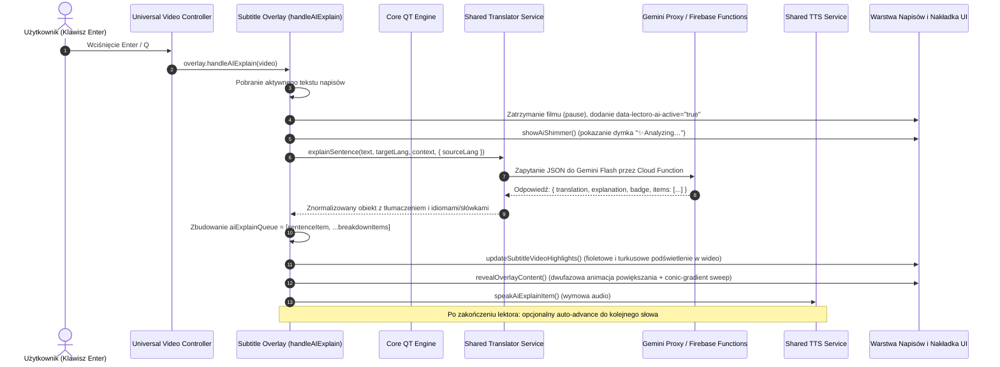

# Dokumentacja Funkcji i Trybu `Enter` (AI Sentence Explanation) w Lectoro

Dokumentacja techniczna, architektoniczna i wizualna funkcji **Enter** w projekcie Lectoro. Opisuje zachowanie, cykl życia, przepływ danych, strukturę DOM oraz **dokładnie przepisane style CSS** odpowiedzialne za prezentację dymka analizy AI oraz podświetlenia napisów.

---

## 1. Czym jest funkcja `Enter`?

W rozszerzeniu Lectoro podczas oglądania wideo z napisami (Netflix, YouTube, odtwarzacze HTML5), wciśnięcie klawisza **`Enter`** (lub alternatywnie **`NumpadEnter`**, **`Q`** / **`q`**) uruchamia **tryb głębokiego wyjaśnienia zdania przez AI** (*AI Deep Sentence Explanation*).

Funkcja ta zatrzymuje odtwarzanie filmu, pobiera bieżący napis (wraz z kontekstem sąsiednich linii) i odpytuje model sztucznej inteligencji (Google Gemini Flash) za pośrednictwem bezpiecznego proxy Firebase. W odpowiedzi generowane jest:
1. **Naturalne, pełne tłumaczenie całego zdania** w języku ojczystym użytkownika (etap 1/N).
2. **Rozbicie na kluczowe elementy (breakdown)**: idiomy, czasowniki frazowe (*phrasal verbs*), slang, kolokacje oraz trudne słownictwo wyodrębnione ze zdania wraz z ich kontekstowym znaczeniem i wyjaśnieniem gramatycznym/użycia (etapy 2..N).
3. **Synchronizacja wizualna z napisami filmu**: słowa odpowiadające elementom z kolejki zostają w locie podświetlone na fioletowo w napisach wideo, a aktualnie omawiany zwrot – na neonowy gradient turkusu i fioletu.
4. **Inteligentny lektor (TTS)**: automatyczne odczytanie wymowy w odpowiednich językach (np. najpierw termin w języku obcym, potem wyjaśnienie w języku ojczystym) z automatycznym lub ręcznym przechodzeniem do kolejnych kroków.
5. **Zapis do powtórek**: możliwość bezpośredniego dodania całego zdania lub pojedynczego idiomu/słowa do bazy powtórek (fiszki / SRS / Anki) za pomocą klawisza **`Z`** lub przycisku w stopce.

---

## 2. Skróty klawiszowe powiązane z trybem Enter

Obsługiwane w plikach [`video/universal-video-controller.js`](file:///Users/kondziu/Desktop/Softileo/Lectoro/video/universal-video-controller.js) oraz [`video/subtitle-overlay.js`](file:///Users/kondziu/Desktop/Softileo/Lectoro/video/subtitle-overlay.js):

| Klawisz | Akcja w odtwarzaczu | Akcja w otwartym dymku Enter AI |
| :--- | :--- | :--- |
| **`Enter`** / **`NumpadEnter`** | Otwiera dymek analizy AI (`handleAIExplain`) | Zamyka dymek i wznawia wideo (`closeAiTooltip`) |
| **`Q`** / **`q`** | Otwiera dymek analizy AI | Zamyka dymek i wznawia wideo |
| **`Escape`** / **`W`** / **`ArrowUp`** | Zamyka aktywne dymki | Zamyka dymek i wznawia wideo |
| **`D`** / **`ArrowRight`** | Skok wideo w przód | Przejście do **następnego elementu** w kolejce AI (`nextAiExplainItem`) |
| **`A`** / **`ArrowLeft`** | Skok wideo w tył | Przejście do **poprzedniego elementu** w kolejce AI (`prevAiExplainItem`) |
| **`Z`** / **`V`** | Zapis słowa | Zapis aktualnie wyświetlanego elementu AI do powtórek (`saveCurrentAiExplainItem`) |
| **Kliknięcie słowa na napisach** | Tłumaczenie pojedynczego słowa | Przejście bezpośrednio do tego słowa w kolejce AI |
| **Kliknięcie pigułki (pill) we wstążce** | — | Skok do wybranego etapu analizy |

---

## 3. Co dzieje się w funkcji `handleAIExplain(video)`? (Krok po kroku)

Główna logika funkcji znajduje się w pliku [`video/subtitle-overlay.js`](file:///Users/kondziu/Desktop/Softileo/Lectoro/video/subtitle-overlay.js#L2875-L3016).



### Szczegółowy przebieg kodu:

1. **Weryfikacja tekstu napisów**:
   - Funkcja sprawdza `activeText || registry?.getCurrentText()`. Jeżeli na ekranie nie ma aktualnie żadnego tekstu napisu, wykonanie zostaje przerwane.
2. **Zarządzanie współbieżnością (`requestId`)**:
   - Zwiększany jest licznik `++aiExplainRequestId`.
   - Zdefiniowany zostaje predykat:
     ```javascript
     const isCurrent = () => aiTooltipActive && requestId === aiExplainRequestId;
     ```
     Jeśli użytkownik zamknie dymek i otworzy go ponownie zanim nadejdzie odpowiedź sieciowa, stare zapytanie zostanie zignorowane.
3. **Czyszczenie innych trybów i pauza wideo**:
   - Wywołanie `cleanupReading()` i `closeSubTooltip({ resumeVideo: false })`.
   - Jeśli aktywny był tryb czytania lub chmury słów, przywracana jest oryginalna warstwa napisów (`restoreOriginal()`).
   - Ustawienie flagi `aiTooltipActive = true`.
   - Nadanie atrybutu `document.body.setAttribute("data-lectoro-ai-active", "true")` — wyłącza to standardowy niebieski hover dla słów niebędących częścią analizy AI.
   - Wstrzymanie odtwarzania wideo (`pauseIfPlaying(video)`).
   - Ukrycie podręcznych tooltipów słownikowych (`QT.hideTooltip()`).
4. **Zmierzenie pozycji i pobranie kredytów AI**:
   - Zapis geometrii napisów przez `captureSubtitleLayout()` do `aiExplainLayout`.
   - Asynchroniczne sprawdzenie kredytów w pamięci podręcznej: `GeminiProxy.getCachedUsage()`.
   - Sformatowanie odznaki konta:
     - Dla subskrypcji płatnej: `✦ PRO AI`.
     - Dla darmowej: `✦ AI {pozostało}/{limit}` (np. `✦ AI 14/15`).
     - Domyślnie: `✦ AI Free`.
5. **Wyświetlenie animacji ładowania (Shimmer Loader)**:
   - Wywołanie `showAiShimmer(aiExplainLayout)`, które tworzy element `#_qt_sentence_translation` z klasami `__qt_sub-overlay` i `__qt_ai-explain-overlay`, atrybutem `data-state="ai-loading"` oraz tekstem:
     ```html
     <span class="ai-loader-label">✨ Analyzing…</span>
     ```
   - Etykieta ta ma animację przepływającego gradientu (`__qt_ai_shimmer`).
6. **Wywołanie API Gemini**:
   - Pobierane są języki: język ojczysty (`targetLang = await QT.getTargetLang()`) oraz język nauki (`sourceLang = await SharedTranslatorService.getLearningLang()`).
   - Pobierany jest kontekst poprzednich/następnych linii napisów: `getActiveSubtitleContext(video, text)`.
   - Wywołanie `QT.geminiExplainSentence(text, targetLang, context, { sourceLang })`.
   - Prompt instruuje model Gemini, aby zwrócił JSON o ściśle określonej strukturze:
     - `translation`: dokładne, jednowierszowe tłumaczenie całego zdania z zachowaniem wszystkich zdań składowych.
     - `explanation`: zwięzłe wyjaśnienie gramatyczne lub kontekstowe (jeśli potrzebne).
     - `badge`: zlokalizowana etykieta (np. "Zdanie", "Sentence").
     - `items`: tablica 0–4 kluczowych pojęć, zawierająca idiomy, czasowniki złożone (`phrasal_verb`), slang i kluczowe słownictwo, w kolejności ich występowania w zdaniu.
7. **Budowanie kolejki wyjaśnień (`aiExplainQueue`)**:
   - Pierwszym elementem (`index 0`) **zawsze** jest tłumaczenie całego zdania (`type: "sentence"`).
   - Kolejnymi elementami są poszczególne zwroty z `items`:
     ```javascript
     aiExplainQueue = breakdownItems.length > 0
         ? [sentenceItem, ...breakdownItems]
         : [sentenceItem];
     ```
   - Inicjalizacja indeksu: `aiExplainIndex = 0` i wywołanie `showAiExplainItem(0)`.
8. **Prezentacja kroku (`showAiExplainItem`)**:
   - Anulowanie bieżącej mowy TTS (`SharedTtsService.cancel()`).
   - Rejestracja globalnego listenera klawiszy `ensureAiExplainKeydownListener()` (dla klawiszy A, D, Z, W, Escape).
   - **Podświetlenie słów w odtwarzaczu (`updateSubtitleVideoHighlights()`)**:
     - Wszystkie nadchodzące i poprzednie pozycje z kolejki otrzymują klasę `__qt_ai-sub-queued` / `__qt_ai-sub-upcoming` (miękki fiolet).
     - Aktualnie omawiana pozycja otrzymuje klasę `__qt_ai-sub-active` (neonowy gradient turkusowo-fioletowy).
     - Słowa wielowyrazowe są łączone wspólnym wrapperem `__qt_ai-sub-wrap` z zachowaniem ciągłości tła (`box-decoration-break: clone`).
   - Wyrenderowanie zawartości HTML przez `renderAiExplainContent(clampedIndex)`.
   - Ujawnienie zawartości z płynną dwufazową animacją wymiarów (`revealOverlayContent`):
     - `data-state="measuring"` (mierzenie wymiarów w tle),
     - `data-state="expanding"` (płynna animacja szerokości i wysokości w 0.22s),
     - `data-state="ready"` z dodaniem klasy `__qt_translation-reveal` — uruchamia to efektowny obrót obramowania `conic-gradient` (`__qt_ai_border_sweep`).
   - Podpięcie zdarzeń: kliknięcie pigułek wstążki, przycisków poprzedni/następny, przycisku odsłuchu `__qt_speak` oraz przycisków zapisu fiszek `Save (Z)` i `AI Sentence`.
   - Uruchomienie lektora TTS (`speakAiExplainItem`):
     - Dla całego zdania: odczytanie tłumaczenia w języku docelowym.
     - Dla idiomu/słowa: odczytanie oryginalnego terminu w języku nauki, krótka pauza (350 ms), a następnie odczytanie znaczenia i wyjaśnienia w języku docelowym.
   - Po zakończeniu wypowiedzi TTS: jeśli użytkownik nie nawigował ręcznie (`!aiAutoAdvanceDisabled`), po 2.0s (lub 3.5s bez audio) automatycznie wywoływany jest kolejny krok `showAiExplainItem(aiExplainIndex + 1)`.
9. **Obsługa błędów i limitu kredytów (In-Video Paywall)**:
   - Jeśli zapytanie zwróci błąd limitu (`GeminiProxy.isLimitError(err)`), dymek nie wyświetla surowego błędu, lecz przekształca się w **In-Video Paywall Modal** (`showAiPaywallOverlay`).
   - Wyświetla on elegancką kartę z informacją o wyczerpaniu darmowego limitu, listą zalet subskrypcji Pro, przyciskiem wznowienia wideo oraz przyciskiem przejścia do subskrypcji.

---

## 4. Jak wygląda interfejs? (Struktura wizualna i HTML)

Dymek `Enter` to pływający panel typu **Glassmorphism**, pozycjonowany automatycznie tuż nad (lub pod) aktywnym napisem na ekranie odtwarzacza.

### Hierarchia elementów:
1. **Pasek nagłówka (`.__qt_header`)**:
   - **Wstążka zakładek (`.__qt_ai-queue-ribbon`)**: przewijana poziomo lista pigułek reprezentujących każdy krok (💬 Zdanie, ✨ Idiom, ✨ Słowo). Aktywny krok ma turkusowe obramowanie i poświatę; pozostałe są fioletowe.
   - **Odznaka kredytów (`.__qt_ai-credit-pill`)**: np. `✦ AI 14/15` lub złota `✦ PRO AI`.
   - **Nawigacja krokowa (`.__qt_ai-nav-group`)**: przycisk `◀`, licznik kroków (np. `1/3`), przycisk `▶`.
2. **Główna treść (`.__qt_body`)**:
   - **Gdy krok to całe zdanie (`data-type="sentence"`)**:
     - Wyraźne, duże tłumaczenie zdania (`.__qt_ai-term-meaning`).
     - Obok przycisk odtworzenia wymowy lektora (`.__qt_speak`).
   - **Gdy krok to idiom / phrasal verb / słowo**:
     - Górna etykieta z odznaką (`.__qt_ai-badge`), np. `IDIOM` lub `CZASOWNIK ZŁOŻONY`.
     - Wyróżniony oryginalny termin w neonowym turkusie (`.__qt_ai-term`) wraz z przyciskiem lektora.
     - Przetłumaczone znaczenie w języku polskim (`.__qt_ai-term-meaning`).
     - Dodatkowa ramka z wyjaśnieniem kontekstowym i gramatycznym (`.__qt_ai-term-explanation`), z żółtym wyróżnieniem cytowanych zwrotów (`.__qt_tts-original-quote`).
3. **Stopka akcji (`.__qt_save-footer`)**:
   - Przycisk zapisu do powtórek `Save (Z)` z ikoną zakładki i podpowiedzią klawisza `<kbd>Z</kbd>`. Po zapisaniu zmienia kolor na turkusowy ze stanem `Saved!`.
   - Przycisk generowania inteligentnego zdania fiszkowego `AI Sentence`.

---

## 5. Dynamiczne skalowanie fontów w JavaScript

Plik [`video/subtitle-overlay.js`](file:///Users/kondziu/Desktop/Softileo/Lectoro/video/subtitle-overlay.js#L3537-L3571) oblicza i wstrzykuje do dymka zestaw zmiennych CSS zależnych od rzeczywistej wysokości czcionki napisów na filmie (`effectiveSource`):

```javascript
// Enter AI explanation proportional font sizes (scaled percentage-wise to subtitle text)
const termSize =
    Math.round(Math.max(13, Math.min(30, effectiveSource * 0.58)) * 10) / 10;
const meaningSize =
    Math.round(Math.max(12, Math.min(26, effectiveSource * 0.48)) * 10) / 10;
const explanationSize =
    Math.round(Math.max(11, Math.min(20, effectiveSource * 0.40)) * 10) / 10;
const metaSize =
    Math.round(Math.max(9, Math.min(15, effectiveSource * 0.30)) * 10) / 10;
const sentenceTermSize =
    Math.round(Math.max(13, Math.min(26, effectiveSource * 0.40)) * 10) / 10;
const sentenceMeaningSize = meaningSize;
const badgeSize =
    Math.round(Math.max(7.5, Math.min(10.5, effectiveSource * 0.28)) * 10) / 10;

overlay.style.setProperty("--lectoro-ai-term-font-size", `${termSize}px`);
overlay.style.setProperty("--lectoro-ai-meaning-font-size", `${meaningSize}px`);
overlay.style.setProperty("--lectoro-ai-explanation-font-size", `${explanationSize}px`);
overlay.style.setProperty("--lectoro-ai-badge-font-size", `${badgeSize}px`);
overlay.style.setProperty("--lectoro-ai-meta-font-size", `${metaSize}px`);
overlay.style.setProperty("--lectoro-ai-sentence-term-font-size", `${sentenceTermSize}px`);
overlay.style.setProperty("--lectoro-ai-sentence-meaning-font-size", `${sentenceMeaningSize}px`);
```

---

## 6. Dokładnie przepisane Style CSS (ze `styles.css`)

Poniżej znajdują się **dokładnie przepisane, oryginalne reguły CSS** z pliku [`styles.css`](file:///Users/kondziu/Desktop/Softileo/Lectoro/styles.css), odpowiedzialne za wygląd dymka Enter AI, animacje, wstążkę kroków, karty, przyciski oraz podświetlenia napisów w odtwarzaczu.

### 6.1. Zmienne bazowe i kontener nakładki dymka

```css
#__qt_sentence_translation {
  --lectoro-ai-term-font-size: 15px;
  --lectoro-ai-meaning-font-size: 15px;
  --lectoro-ai-explanation-font-size: 12px;
  --lectoro-ai-badge-font-size: 8px;
  --lectoro-ai-meta-font-size: 9.5px;
  --lectoro-ai-sentence-term-font-size: 14px;
  --lectoro-ai-sentence-meaning-font-size: 15px;
}

#__qt_sentence_translation.__qt_sub-overlay {
  position: fixed !important;
  z-index: 2147483647 !important;
  width: auto !important;
  height: auto !important;
  min-width: 0 !important;
  max-width: min(520px, calc(100vw - 24px)) !important;
  max-height: min(560px, calc(100vh - 48px)) !important;
  bottom: auto !important;
  right: auto !important;
  padding: 0 !important;
  border: 1px solid rgba(255, 255, 255, 0.08) !important;
  border-radius: 16px !important;
  background: #0f0f23bf !important;
  box-shadow:
    0 8px 32px rgba(0, 0, 0, 0.4),
    0 0 0 1px rgba(255, 255, 255, 0.08) inset !important;
  backdrop-filter: blur(20px) saturate(1.4) !important;
  -webkit-backdrop-filter: blur(20px) saturate(1.4) !important;
  color: #ffffff !important;
  font:
    14px/1.5 "Inter",
    -apple-system,
    "Segoe UI",
    Roboto,
    Helvetica,
    Arial,
    sans-serif !important;
  pointer-events: auto !important;
  display: flex !important;
  flex-direction: column !important;
  align-items: stretch !important;
  justify-content: flex-start !important;
  box-sizing: border-box !important;
  isolation: isolate !important;
  transform-origin: 50% 100% !important;
  animation: __qt_translation_bubble_in 0.2s cubic-bezier(0.34, 1.3, 0.64, 1)
    both !important;
  transition:
    left 0.25s cubic-bezier(0.2, 0.8, 0.2, 1),
    top 0.25s cubic-bezier(0.2, 0.8, 0.2, 1) !important;
}

#__qt_sentence_translation[data-state="measuring"] {
  width: max-content !important;
  height: auto !important;
  max-height: min(560px, calc(100vh - 48px)) !important;
  bottom: auto !important;
  right: auto !important;
  visibility: hidden !important;
  animation: none !important;
}

#__qt_sentence_translation[data-state="expanding"] {
  min-width: 0 !important;
  max-height: min(560px, calc(100vh - 48px)) !important;
  bottom: auto !important;
  right: auto !important;
  border-radius: 16px !important;
  animation: none !important;
  transition:
    width 0.22s cubic-bezier(0.2, 0.8, 0.2, 1),
    height 0.22s cubic-bezier(0.2, 0.8, 0.2, 1),
    border-radius 0.16s ease-out !important;
}

#__qt_sentence_translation[data-state="ready"] {
  animation: none !important;
  height: auto !important;
  max-height: min(560px, calc(100vh - 48px)) !important;
  bottom: auto !important;
  right: auto !important;
}

#__qt_sentence_translation .__qt_translation-copy {
  display: flex !important;
  width: 100% !important;
  min-width: 0 !important;
  flex-direction: column !important;
  align-items: stretch !important;
  color: inherit !important;
  font: inherit !important;
  opacity: 1;
}

#__qt_sentence_translation[data-state="expanding"] .__qt_translation-copy {
  opacity: 0 !important;
  transition: none !important;
}

#__qt_sentence_translation[data-state="ready"].__qt_translation-reveal
  .__qt_translation-copy {
  animation: __qt_translation_copy_reveal 0.13s ease-out both !important;
}

@keyframes __qt_translation_bubble_in {
  from {
    opacity: 0;
    transform: translateY(7px) scale(0.96);
  }

  to {
    opacity: 1;
    transform: translateY(0) scale(1);
  }
}

@keyframes __qt_translation_copy_reveal {
  from {
    opacity: 0;
    transform: translateY(2px);
  }

  to {
    opacity: 1;
    transform: translateY(0);
  }
}

@media (prefers-reduced-motion: reduce) {
  #__qt_sentence_translation.__qt_sub-overlay,
  #__qt_sentence_translation .__qt_translation-copy {
    animation: none !important;
    transition: none !important;
  }
}
```

---

### 6.2. Efekt obrotu obramowania (Conic Gradient Sweep)

```css
@property --qt-ai-angle {
  syntax: "<angle>";
  inherits: false;
  initial-value: 0deg;
}

@keyframes __qt_ai_border_sweep {
  0% {
    --qt-ai-angle: 0deg;
    opacity: 0;
  }

  10% {
    opacity: 1;
  }

  90% {
    opacity: 1;
  }

  100% {
    --qt-ai-angle: 360deg;
    opacity: 0;
  }
}

#__qt_sentence_translation.__qt_ai-explain-overlay {
  pointer-events: auto !important;
  cursor: default !important;
  user-select: text !important;
  height: auto !important;
  max-height: min(560px, calc(100vh - 48px)) !important;
  bottom: auto !important;
  right: auto !important;
  position: fixed !important;
}

#__qt_sentence_translation.__qt_ai-explain-overlay::before {
  content: "";
  position: absolute;
  inset: -1.5px;
  border-radius: 17px;
  padding: 1.5px;
  background: conic-gradient(
    from var(--qt-ai-angle, 0deg),
    transparent 0%,
    transparent 25%,
    #a855f7 45%,
    #4ecdc4 65%,
    #ffffff 80%,
    #a855f7 92%,
    transparent 100%
  );
  -webkit-mask:
    linear-gradient(#fff 0 0) content-box,
    linear-gradient(#fff 0 0);
  -webkit-mask-composite: xor;
  mask-composite: exclude;
  pointer-events: none;
  opacity: 0;
  z-index: 2;
}

#__qt_sentence_translation.__qt_ai-explain-overlay[data-state="ready"].__qt_translation-reveal::before {
  animation: __qt_ai_border_sweep 2.2s cubic-bezier(0.35, 1, 0.5, 0.9) 1
    forwards;
}
```

---

### 6.3. Stan ładowania (Shimmer Loader)

```css
#__qt_sentence_translation[data-state="ai-loading"],
#__qt_sentence_translation[data-state="loading"] {
  width: max-content !important;
  height: auto !important;
  max-height: min(560px, calc(100vh - 48px)) !important;
  bottom: auto !important;
  right: auto !important;
  min-width: 0 !important;
  padding: 10px 20px !important;
  border-radius: 16px !important;
  display: flex !important;
  align-items: center !important;
  justify-content: center !important;
  text-align: center !important;
  box-sizing: border-box !important;
}

.ai-loader-label {
  display: inline-flex;
  align-items: center;
  justify-content: center;
  font:
    600 13px/1.2 "Inter",
    -apple-system,
    BlinkMacSystemFont,
    "Segoe UI",
    Roboto,
    sans-serif;
  letter-spacing: 0.03em;
  color: transparent;
  background: linear-gradient(
    90deg,
    #a855f7 0%,
    #4ecdc4 25%,
    #ffffff 50%,
    #4ecdc4 75%,
    #a855f7 100%
  );
  background-size: 200% 100%;
  -webkit-background-clip: text;
  background-clip: text;
  -webkit-text-fill-color: transparent;
  animation: __qt_ai_shimmer 1.8s linear infinite;
}

@keyframes __qt_ai_shimmer {
  0% {
    background-position: 0% 50%;
  }

  100% {
    background-position: 200% 50%;
  }
}
```

---

### 6.4. Wstążka etapów (Ribbon), pigułki i nawigacja

```css
#__qt_sentence_translation .__qt_header {
  display: flex !important;
  align-items: center !important;
  justify-content: space-between !important;
  width: 100% !important;
  box-sizing: border-box !important;
  padding: 8px 12px 4px !important;
}

#__qt_sentence_translation .__qt_ai-queue-ribbon {
  display: none !important;
  align-items: center !important;
  gap: 6px !important;
  padding: 2px 2px !important;
  overflow-x: auto !important;
  overflow-y: hidden !important;
  scrollbar-width: none !important;
  -webkit-overflow-scrolling: touch !important;
  max-width: 100% !important;
}

#__qt_sentence_translation .__qt_ai-queue-ribbon::-webkit-scrollbar {
  display: none !important;
}

#__qt_sentence_translation .__qt_ai-queue-pill {
  display: inline-flex !important;
  align-items: center !important;
  gap: 4px !important;
  padding: 2px 8px !important;
  border-radius: 10px !important;
  font-size: 9px !important;
  font-weight: 600 !important;
  line-height: 1.2 !important;
  white-space: nowrap !important;
  cursor: pointer !important;
  transition: all 0.2s cubic-bezier(0.2, 0.8, 0.2, 1) !important;
  border: 1px solid rgba(255, 255, 255, 0.1) !important;
  background: rgba(255, 255, 255, 0.04) !important;
  color: rgba(255, 255, 255, 0.55) !important;
  user-select: none !important;
}

#__qt_sentence_translation .__qt_ai-queue-pill:hover {
  color: #ffffff !important;
  background: rgba(255, 255, 255, 0.08) !important;
  border-color: rgba(255, 255, 255, 0.2) !important;
}

/* Nadchodzące idiomy/słówka w kolejce: lekki bg fioletowego */
#__qt_sentence_translation .__qt_ai-queue-pill.__qt_ai-pill-upcoming {
  background: rgba(168, 85, 247, 0.16) !important;
  border: 1px solid rgba(168, 85, 247, 0.35) !important;
  color: #e9d5ff !important;
}

#__qt_sentence_translation .__qt_ai-queue-pill.__qt_ai-pill-upcoming:hover {
  background: rgba(168, 85, 247, 0.26) !important;
  border-color: #c084fc !important;
  color: #ffffff !important;
}

/* Podświetlenie pigułki we wstążce dymka AI, gdy kursor najeżdża na odpowiadające słowo w napisach */
#__qt_sentence_translation .__qt_ai-queue-pill.__qt_pill-highlight {
  background: rgba(168, 85, 247, 0.42) !important;
  border-color: #c084fc !important;
  color: #ffffff !important;
  box-shadow: 0 0 10px rgba(168, 85, 247, 0.55) !important;
  transform: translateY(-1px) scale(1.05) !important;
}

/* Aktywny krok */
#__qt_sentence_translation .__qt_ai-queue-pill.active {
  background: linear-gradient(
    135deg,
    rgba(78, 205, 196, 0.28),
    rgba(168, 85, 247, 0.28)
  ) !important;
  border: 1px solid #4ecdc4 !important;
  color: #ffffff !important;
  box-shadow: 0 0 10px rgba(78, 205, 196, 0.35) !important;
}

#__qt_sentence_translation .__qt_ai-queue-pill .__qt_pill-icon {
  font-size: 10px !important;
  line-height: 1 !important;
}

/* Odznaka kredytów AI */
#__qt_sentence_translation .__qt_ai-credit-pill {
  display: inline-flex !important;
  align-items: center !important;
  gap: 3px !important;
  padding: 1.5px 8px !important;
  border-radius: 999px !important;
  font-size: 9.5px !important;
  font-weight: 700 !important;
  color: #c7d2fe !important;
  background: rgba(99, 102, 241, 0.18) !important;
  border: 1px solid rgba(129, 140, 248, 0.35) !important;
  letter-spacing: 0.2px !important;
  user-select: none !important;
  line-height: 1.3 !important;
  flex-shrink: 0 !important;
}

#__qt_sentence_translation .__qt_ai-credit-pill.is-pro {
  color: #fef08a !important;
  background: rgba(234, 179, 8, 0.16) !important;
  border: 1px solid rgba(234, 179, 8, 0.38) !important;
}

/* Przyciski nawigacji krokowego przejścia */
#__qt_sentence_translation .__qt_ai-nav-group {
  display: inline-flex !important;
  align-items: center !important;
  justify-content: flex-end !important;
  gap: 3px !important;
  margin-left: auto !important;
  flex-shrink: 0 !important;
}

#__qt_sentence_translation .__qt_ai-nav-btn {
  display: inline-flex !important;
  align-items: center !important;
  justify-content: center !important;
  gap: 2px !important;
  padding: 3px 6px !important;
  border-radius: 6px !important;
  font-size: var(--lectoro-ai-meta-font-size, 10px) !important;
  font-weight: 600 !important;
  border: 1px solid rgba(255, 255, 255, 0.1) !important;
  background: rgba(255, 255, 255, 0.05) !important;
  color: rgba(255, 255, 255, 0.65) !important;
  cursor: pointer !important;
  transition: all 0.2s ease !important;
}

#__qt_sentence_translation .__qt_ai-nav-btn:hover:not(:disabled) {
  background: rgba(255, 255, 255, 0.12) !important;
  color: #ffffff !important;
  border-color: rgba(255, 255, 255, 0.2) !important;
}

#__qt_sentence_translation .__qt_ai-nav-btn:disabled {
  opacity: 0.25 !important;
  cursor: not-allowed !important;
}

#__qt_sentence_translation .__qt_ai-step-counter {
  font-size: var(--lectoro-ai-meta-font-size, 10px) !important;
  font-weight: 600 !important;
  color: rgba(255, 255, 255, 0.4) !important;
  padding: 0 4px !important;
  letter-spacing: 0.5px !important;
}
```

---

### 6.5. Prezentacja treści (Karta słowa vs Karta pełnego zdania)

```css
/* Szczegóły aktywnego idiomu / trudnego słowa */
#__qt_sentence_translation .__qt_ai-term-card {
  display: flex !important;
  flex-direction: column !important;
  align-items: center !important;
  justify-content: flex-start !important;
  text-align: center !important;
  gap: 10px !important;
  width: 100% !important;
}

#__qt_sentence_translation .__qt_ai-term-header {
  display: inline-flex !important;
  flex-direction: column !important;
  align-items: center !important;
  justify-content: center !important;
  gap: 2px !important;
  width: 100% !important;
  text-align: center !important;
}

#__qt_sentence_translation .__qt_ai-term-title-wrap {
  display: inline-flex !important;
  align-items: center !important;
  justify-content: center !important;
  gap: 8px !important;
  flex-wrap: wrap !important;
  text-align: center !important;
}

#__qt_sentence_translation .__qt_ai-term {
  font-size: var(--lectoro-ai-term-font-size, 15px) !important;
  font-weight: 700 !important;
  letter-spacing: -0.2px !important;
  color: #00ffea !important;
  line-height: 1.35 !important;
  text-align: center !important;
}

#__qt_sentence_translation .__qt_ai-badge {
  font-size: var(--lectoro-ai-badge-font-size, 8px) !important;
  font-weight: 700 !important;
  text-transform: uppercase !important;
  letter-spacing: 0.9px !important;
  line-height: 1 !important;
  padding: 2px 7px !important;
  border-radius: 999px !important;
  background: rgba(168, 85, 247, 0.16) !important;
  border: 1px solid rgba(168, 85, 247, 0.32) !important;
  color: #e9d5ff !important;
  margin-bottom: 2px !important;
  display: inline-block !important;
}

#__qt_sentence_translation .__qt_ai-term-meaning {
  font-size: var(--lectoro-ai-meaning-font-size, 16px) !important;
  font-weight: 700 !important;
  color: rgba(255, 255, 255, 0.95) !important;
  text-align: center !important;
  width: 100% !important;
  margin-top: 2px !important;
}

#__qt_sentence_translation .__qt_ai-term-explanation {
  font-size: var(--lectoro-ai-explanation-font-size, 12px) !important;
  line-height: 1.55 !important;
  color: rgba(255, 255, 255, 0.82) !important;
  background: rgba(255, 255, 255, 0.03) !important;
  border: 1px solid rgba(255, 255, 255, 0.06) !important;
  border-radius: 12px !important;
  padding: 10px 14px !important;
  text-align: center !important;
  width: 100% !important;
  box-sizing: border-box !important;
  margin-top: 4px !important;
}

/* Dedykowana hierarchia wizualna dla tłumaczenia pełnego zdania */
#__qt_sentence_translation .__qt_ai-term-card[data-type="sentence"] {
  gap: 0 !important;
  justify-content: flex-start !important;
  margin: 0 !important;
  padding: 0 !important;
}

#__qt_sentence_translation .__qt_ai-sentence-wrap {
  display: inline-flex !important;
  align-items: center !important;
  justify-content: center !important;
  gap: 8px !important;
  width: 100% !important;
  margin: 0 !important;
  padding: 0 !important;
}

#__qt_sentence_translation .__qt_ai-sentence-wrap .__qt_ai-term-meaning {
  width: auto !important;
  max-width: calc(100% - 36px) !important;
  margin-top: 0 !important;
}

#__qt_sentence_translation
  .__qt_ai-term-card[data-type="sentence"]
  .__qt_ai-term {
  font-size: var(--lectoro-ai-sentence-term-font-size, 15px) !important;
  font-weight: 600 !important;
  color: #00ffea !important;
  line-height: 1.45 !important;
  text-align: center !important;
}

#__qt_sentence_translation
  .__qt_ai-term-card[data-type="sentence"]
  .__qt_ai-term-meaning {
  font-size: var(--lectoro-ai-sentence-meaning-font-size, 16px) !important;
  font-weight: 700 !important;
  color: rgba(255, 255, 255, 0.95) !important;
  text-align: center !important;
  margin-top: 0 !important;
}
```

---

### 6.6. Przycisk lektora audio (TTS) i cytaty w wyjaśnieniach

```css
#__qt_sentence_translation .__qt_word-actions {
  flex-shrink: 0 !important;
  display: flex !important;
  align-items: center !important;
  justify-content: center !important;
  gap: 6px !important;
}

#__qt_sentence_translation .__qt_speak {
  flex-shrink: 0 !important;
  background: rgba(255, 255, 255, 0.05) !important;
  border: 1px solid rgba(255, 255, 255, 0.08) !important;
  color: rgba(255, 255, 255, 0.4) !important;
  cursor: pointer !important;
  padding: 4px !important;
  border-radius: 8px !important;
  display: flex !important;
  align-items: center !important;
  justify-content: center !important;
  width: 26px !important;
  height: 26px !important;
  transition: all 0.2s ease !important;
}

#__qt_sentence_translation .__qt_speak:hover {
  color: #ffffff !important;
  background: rgba(255, 255, 255, 0.1) !important;
  border-color: rgba(255, 255, 255, 0.15) !important;
}

#__qt_sentence_translation .__qt_speak.speaking {
  color: #4ecdc4 !important;
  border-color: rgba(78, 205, 196, 0.3) !important;
  background: rgba(78, 205, 196, 0.1) !important;
}

#__qt_sentence_translation .__qt_speak svg {
  width: 14px;
  height: 14px;
}

/* Wyróżnienie cytowanych słów źródłowych w tekście wyjaśnienia */
#__qt_sentence_translation .__qt_tts-original-quote,
#__qt_tooltip .__qt_tts-original-quote,
.__qt_tts-original-quote {
  color: #ffd000 !important;
  font-weight: 500 !important;
}
```

---

### 6.7. Stopka zapisu słów i fiszek (`Save` i `AI Sentence`)

```css
#__qt_sentence_translation .__qt_save-footer {
  display: flex !important;
  gap: 6px !important;
  padding: 6px 14px 8px !important;
  border-top: 1px solid rgba(255, 255, 255, 0.08) !important;
  justify-content: flex-end !important;
  width: 100% !important;
  box-sizing: border-box !important;
}

#__qt_sentence_translation .__qt_save-footer-btn {
  display: inline-flex !important;
  align-items: center !important;
  gap: 4px !important;
  padding: 3px 8px !important;
  border: 1px solid rgba(255, 255, 255, 0.12) !important;
  border-radius: 6px !important;
  background: rgba(255, 255, 255, 0.06) !important;
  color: rgba(255, 255, 255, 0.7) !important;
  font-size: 10px !important;
  font-family:
    -apple-system, BlinkMacSystemFont, "Segoe UI", Roboto, sans-serif !important;
  cursor: pointer !important;
  transition: all 0.2s ease !important;
  white-space: nowrap !important;
  min-width: 0 !important;
  min-height: 0 !important;
  box-shadow: none !important;
}

#__qt_sentence_translation .__qt_save-footer-btn:hover {
  background: rgba(255, 255, 255, 0.12) !important;
  color: #fff !important;
  border-color: rgba(255, 255, 255, 0.2) !important;
  transform: translateY(-1px) !important;
}

#__qt_sentence_translation .__qt_save-footer-btn.saved {
  color: #4ecdc4 !important;
  border-color: rgba(78, 205, 196, 0.3) !important;
  background: rgba(78, 205, 196, 0.1) !important;
  pointer-events: none !important;
}

#__qt_sentence_translation .__qt_save-footer-btn.loading {
  cursor: wait !important;
  pointer-events: none !important;
  opacity: 0.95 !important;
}

#__qt_sentence_translation .__qt_save-footer-btn svg {
  width: 12px;
  height: 12px;
  flex: 0 0 auto;
}

#__qt_sentence_translation .__qt_save-ai-btn {
  border-color: rgba(168, 85, 247, 0.3) !important;
  background: rgba(168, 85, 247, 0.08) !important;
  color: rgba(200, 160, 255, 0.85) !important;
}

#__qt_sentence_translation .__qt_save-ai-btn:hover {
  background: rgba(168, 85, 247, 0.16) !important;
  border-color: rgba(168, 85, 247, 0.5) !important;
  color: #fff !important;
}

.__qt_save-footer-btn .__qt_key-hint,
.__qt_save-footer-btn kbd {
  margin-left: 2px !important;
  padding: 1px 3px !important;
  font-size: 8.5px !important;
  line-height: 1 !important;
  font-weight: 600 !important;
  border: 1px solid rgba(255, 255, 255, 0.2) !important;
  border-radius: 3px !important;
  background: rgba(255, 255, 255, 0.08) !important;
  color: rgba(255, 255, 255, 0.6) !important;
  font-family: inherit !important;
}

#__qt_sentence_translation .__qt_error {
  color: #fda4af;
  font-size: 13px;
  font-weight: 500;
}
```

---

### 6.8. Podświetlanie słów na napisach filmu (Video Subtitle Highlights)

```css
/* Unified phrase/word wrapper ensuring contiguous background across multi-word idioms */
.__qt_word-cloud-phrase,
.__qt_ai-sub-wrap {
  display: inline !important;
  box-decoration-break: clone !important;
  -webkit-box-decoration-break: clone !important;
  border-radius: 4px !important;
  padding: 0 !important;
  margin: 0 !important;
  line-height: inherit !important;
  pointer-events: auto !important;
  transition: all 0.3s cubic-bezier(0.2, 0.8, 0.2, 1) !important;
}

/* Neutralize individual word borders/backgrounds inside the unified phrase wrapper */
.__qt_word-cloud-phrase .__qt_sub-word,
#__qt_custom_subtitles_layer .__qt_word-cloud-phrase .__qt_sub-word:hover,
#__qt_custom_subtitles_layer .__qt_word-cloud-phrase .__qt_sub-word.__qt_word-hover,
.__qt_ai-sub-wrap .__qt_sub-word,
#__qt_custom_subtitles_layer .__qt_ai-sub-wrap .__qt_sub-word:hover,
#__qt_custom_subtitles_layer .__qt_ai-sub-wrap .__qt_sub-word.__qt_word-hover,
#__qt_custom_subtitles_layer .__qt_sub-word.__qt_ai-sub-queued:hover,
#__qt_custom_subtitles_layer .__qt_sub-word.__qt_ai-sub-active:hover,
#__qt_custom_subtitles_layer .__qt_sub-word.__qt_ai-sub-upcoming:hover {
  background: transparent !important;
  box-shadow: none !important;
  border-radius: 0 !important;
  padding: 0 !important;
  margin: 0 !important;
  color: inherit !important;
  text-shadow: inherit !important;
  transition: color 0.25s ease !important;
}

/* Active term currently being explained (neon cyan & violet gradient) */
.__qt_ai-sub-wrap.__qt_ai-sub-active,
.__qt_ai-sub-active {
  background: linear-gradient(
    135deg,
    rgba(78, 205, 196, 0.45),
    rgba(168, 85, 247, 0.45)
  ) !important;
  color: #ffffff !important;
  text-shadow:
    0 0 8px rgba(78, 205, 196, 0.8),
    0 1px 2px rgba(0, 0, 0, 0.9) !important;
  border-radius: 4px !important;
  box-shadow:
    inset 0 0 0 1px #4ecdc4,
    0 0 8px rgba(78, 205, 196, 0.45) !important;
  padding: 0 !important;
  margin: 0 !important;
  cursor: pointer !important;
  animation: __qt_sub_highlight_glow_in 0.42s cubic-bezier(0.16, 1, 0.3, 1) both !important;
  transition: all 0.2s cubic-bezier(0.2, 0.8, 0.2, 1) !important;
}

/* Queued terms: upcoming and previous idioms/words in the sentence (soft violet) */
.__qt_ai-sub-wrap.__qt_ai-sub-upcoming,
.__qt_ai-sub-wrap.__qt_ai-sub-queued,
.__qt_ai-sub-upcoming,
.__qt_ai-sub-queued {
  background: rgba(168, 85, 247, 0.26) !important;
  color: #f3e8ff !important;
  text-shadow:
    0 0 8px rgba(168, 85, 247, 0.7),
    0 1px 2px rgba(0, 0, 0, 0.9) !important;
  border-radius: 4px !important;
  box-shadow: inset 0 0 0 1px rgba(168, 85, 247, 0.4) !important;
  padding: 0 !important;
  margin: 0 !important;
  cursor: pointer !important;
  animation: __qt_sub_queued_fade_in 0.42s cubic-bezier(0.16, 1, 0.3, 1) both !important;
  transition: all 0.2s cubic-bezier(0.2, 0.8, 0.2, 1) !important;
}

/* Dopasowany hover dla podświetlonych terminów fioletowych (queued / upcoming) */
.__qt_ai-sub-wrap:hover,
.__qt_ai-sub-wrap.__qt_ai-sub-queued:hover,
.__qt_ai-sub-wrap.__qt_ai-sub-upcoming:hover,
.__qt_ai-sub-queued:hover,
.__qt_ai-sub-upcoming:hover {
  background: rgba(168, 85, 247, 0.42) !important;
  box-shadow:
    inset 0 0 0 1.5px #c084fc,
    0 0 12px rgba(168, 85, 247, 0.65) !important;
  color: #ffffff !important;
  text-shadow:
    0 0 10px rgba(168, 85, 247, 0.95),
    0 1px 2px rgba(0, 0, 0, 0.9) !important;
  cursor: pointer !important;
  filter: brightness(1.15) !important;
}

/* Dopasowany hover dla podświetlonego aktywnego terminu (cyan gradient) */
.__qt_ai-sub-wrap.__qt_ai-sub-active:hover,
.__qt_ai-sub-active:hover {
  background: linear-gradient(
    135deg,
    rgba(78, 205, 196, 0.62),
    rgba(168, 85, 247, 0.62)
  ) !important;
  box-shadow:
    inset 0 0 0 1.5px #00ffea,
    0 0 14px rgba(78, 205, 196, 0.75) !important;
  color: #ffffff !important;
  text-shadow:
    0 0 10px rgba(78, 205, 196, 0.95),
    0 1px 2px rgba(0, 0, 0, 0.9) !important;
  cursor: pointer !important;
  filter: brightness(1.15) !important;
}

/* Wyłączenie fałszywego niebieskiego hovera dla niepodświetlonych słów podczas aktywnego trybu Enter AI */
body[data-lectoro-ai-active="true"]
  #__qt_custom_subtitles_layer
  .__qt_sub-word:not(.__qt_ai-sub-active):not(.__qt_ai-sub-queued):not(
    .__qt_ai-sub-upcoming
  ) {
  cursor: default !important;
}

body[data-lectoro-ai-active="true"]
  #__qt_custom_subtitles_layer
  .__qt_sub-word:not(.__qt_ai-sub-active):not(.__qt_ai-sub-queued):not(
    .__qt_ai-sub-upcoming
  ):hover {
  background: transparent !important;
  box-shadow: none !important;
  color: inherit !important;
  text-shadow: inherit !important;
}

/* Soft, non-aggressive entrance animation for active highlighted words */
@keyframes __qt_sub_highlight_glow_in {
  0% {
    box-shadow:
      inset 0 0 0 0 rgba(78, 205, 196, 0),
      0 0 0 rgba(78, 205, 196, 0);
    opacity: 0.7;
  }

  50% {
    box-shadow:
      inset 0 0 0 1px rgba(78, 205, 196, 0.9),
      0 0 10px rgba(78, 205, 196, 0.55);
    opacity: 1;
  }

  100% {
    box-shadow:
      inset 0 0 0 1px #4ecdc4,
      0 0 8px rgba(78, 205, 196, 0.45);
    opacity: 1;
  }
}

/* Smooth fade-in animation for queued (upcoming/previous) words */
@keyframes __qt_sub_queued_fade_in {
  0% {
    box-shadow: inset 0 0 0 0 rgba(168, 85, 247, 0);
    opacity: 0.5;
  }

  50% {
    box-shadow:
      inset 0 0 0 1px rgba(168, 85, 247, 0.6),
      0 0 6px rgba(168, 85, 247, 0.3);
  }

  100% {
    box-shadow: inset 0 0 0 1px rgba(168, 85, 247, 0.4);
    opacity: 1;
  }
}
```

---

### 6.9. Dedykowany Paywall w odtwarzaczu (Gdy limit darmowy zostanie wyczerpany)

```css
#__qt_sentence_translation .__qt_paywall-header {
  display: flex !important;
  align-items: center !important;
  justify-content: space-between !important;
  padding: 8px 12px 6px !important;
  border-bottom: 1px solid rgba(255, 255, 255, 0.08) !important;
  width: 100% !important;
  box-sizing: border-box !important;
}

#__qt_sentence_translation .__qt_paywall-badge-title {
  display: inline-flex !important;
  align-items: center !important;
  gap: 6px !important;
  font-size: 12px !important;
  font-weight: 700 !important;
  color: #f8fafc !important;
  letter-spacing: 0.1px !important;
}

#__qt_sentence_translation .__qt_paywall-icon {
  font-size: 13px !important;
  color: #c084fc !important;
}

#__qt_sentence_translation .__qt_paywall-close-btn {
  background: transparent !important;
  border: none !important;
  color: rgba(255, 255, 255, 0.45) !important;
  font-size: 14px !important;
  cursor: pointer !important;
  padding: 2px 6px !important;
  border-radius: 4px !important;
  line-height: 1 !important;
  transition: all 0.15s ease !important;
}

#__qt_sentence_translation .__qt_paywall-close-btn:hover {
  color: #ffffff !important;
  background: rgba(255, 255, 255, 0.1) !important;
}

#__qt_sentence_translation .__qt_paywall-body {
  padding: 10px 14px !important;
  display: flex !important;
  flex-direction: column !important;
  gap: 9px !important;
  width: 100% !important;
  box-sizing: border-box !important;
  text-align: left !important;
}

#__qt_sentence_translation .__qt_paywall-card {
  display: flex !important;
  flex-direction: column !important;
  gap: 8px !important;
  width: 100% !important;
}

#__qt_sentence_translation .__qt_paywall-status-banner {
  display: flex !important;
  align-items: flex-start !important;
  gap: 8px !important;
  padding: 7px 10px !important;
  background: rgba(16, 185, 129, 0.12) !important;
  border: 1px solid rgba(16, 185, 129, 0.25) !important;
  border-radius: 8px !important;
}

#__qt_sentence_translation .__qt_paywall-check {
  display: inline-flex !important;
  align-items: center !important;
  justify-content: center !important;
  width: 15px !important;
  height: 15px !important;
  border-radius: 50% !important;
  background: #10b981 !important;
  color: #ffffff !important;
  font-size: 9px !important;
  font-weight: 800 !important;
  flex-shrink: 0 !important;
  margin-top: 1px !important;
}

#__qt_sentence_translation .__qt_paywall-status-text {
  display: flex !important;
  flex-direction: column !important;
  gap: 2px !important;
}

#__qt_sentence_translation .__qt_paywall-status-text strong {
  font-size: 11px !important;
  color: #a7f3d0 !important;
  font-weight: 700 !important;
}

#__qt_sentence_translation .__qt_paywall-status-text span {
  font-size: 10px !important;
  color: rgba(255, 255, 255, 0.72) !important;
  line-height: 1.3 !important;
}

#__qt_sentence_translation .__qt_paywall-offer-title {
  font-size: 11px !important;
  font-weight: 700 !important;
  color: #e2e8f0 !important;
  margin-top: 2px !important;
}

#__qt_sentence_translation .__qt_paywall-perks-list {
  list-style: none !important;
  margin: 0 !important;
  padding: 0 !important;
  display: flex !important;
  flex-direction: column !important;
  gap: 5px !important;
}

#__qt_sentence_translation .__qt_paywall-perks-list li {
  display: flex !important;
  align-items: center !important;
  gap: 6px !important;
  font-size: 11px !important;
  color: rgba(255, 255, 255, 0.85) !important;
}

#__qt_sentence_translation .__qt_paywall-spark {
  color: #c084fc !important;
  font-size: 11px !important;
  flex-shrink: 0 !important;
}

#__qt_sentence_translation .__qt_paywall-footer {
  display: flex !important;
  align-items: center !important;
  justify-content: space-between !important;
  gap: 8px !important;
  padding: 8px 14px 10px !important;
  width: 100% !important;
  box-sizing: border-box !important;
  border-top: 1px solid rgba(255, 255, 255, 0.08) !important;
}

#__qt_sentence_translation .__qt_paywall-btn-ghost {
  background: rgba(255, 255, 255, 0.06) !important;
  border: 1px solid rgba(255, 255, 255, 0.14) !important;
  color: rgba(255, 255, 255, 0.8) !important;
  font-size: 11px !important;
  font-weight: 600 !important;
  padding: 5px 12px !important;
  border-radius: 7px !important;
  cursor: pointer !important;
  transition: all 0.15s ease !important;
}

#__qt_sentence_translation .__qt_paywall-btn-ghost:hover {
  background: rgba(255, 255, 255, 0.12) !important;
  color: #ffffff !important;
}

#__qt_sentence_translation .__qt_paywall-btn-primary {
  background: linear-gradient(135deg, #6366f1, #8b5cf6) !important;
  border: 1px solid rgba(168, 85, 247, 0.4) !important;
  color: #ffffff !important;
  font-size: 11px !important;
  font-weight: 700 !important;
  padding: 5px 14px !important;
  border-radius: 7px !important;
  cursor: pointer !important;
  box-shadow: 0 2px 8px rgba(99, 102, 241, 0.35) !important;
  transition: all 0.15s ease !important;
}

#__qt_sentence_translation .__qt_paywall-btn-primary:hover {
  transform: translateY(-1px) !important;
  box-shadow: 0 4px 12px rgba(99, 102, 241, 0.5) !important;
}
```
